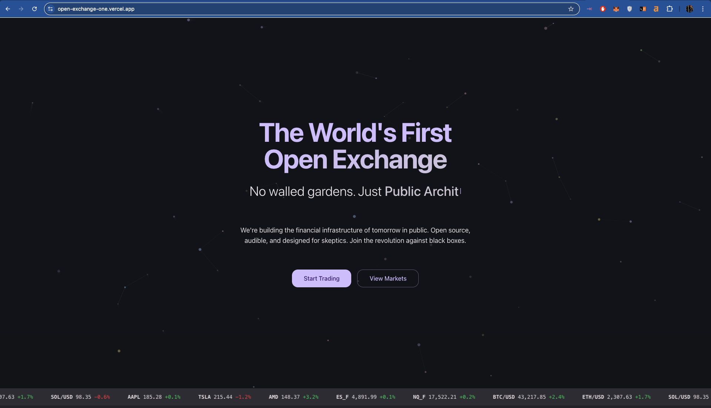
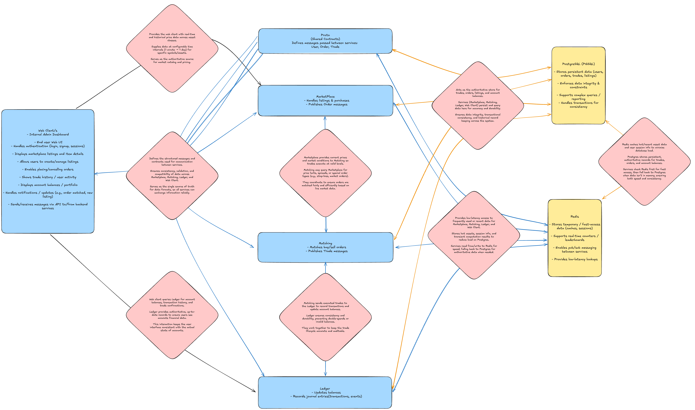

# Open Exchange



https://open-exchange-one.vercel.app/

A multi-service monorepo for a modern trading exchange.

## Architecture



- **Client (`services/client`)**: Next.js frontend application.
- **Ledger (`services/ledger`)**: Rust-based high-performance ledger.
- **Matching Engine (`services/matching`)**: Go-based matching engine.
- **Market Data (`services/market`)**: Go-based market data service.
- **Chain (`services/chain`)**: Hardhat project for EVM contracts (POC).
- **Infrastructure**: Docker Compose, PostgreSQL, Redis.

## Prerequisites

Ensure you have the following installed:

- [Node.js](https://nodejs.org/) (v18+)
- [Go](https://go.dev/) (v1.21+)
- [Rust](https://www.rust-lang.org/) (latest stable)
- [Docker & Docker Compose](https://www.docker.com/)
- [PostgreSQL](https://www.postgresql.org/) (running locally)

## Getting Started

### 1. Environment Configuration

This project uses environment variables for configuration. You need to set up `.env` files for the root workspace and the client service.

**Root Configuration:**

Copy the example environment file:

```bash
cp .env.example .env
```

Modify `.env` if your local PostgreSQL credentials differ from the defaults (user: `postgres`, password: `postgres`, db: `open-exchange-dev`).

**Client/Ledger Configuration:**

Navigate to the client service and copy the example file:

```bash
cd services/client
cp .env.example .env.local

cd services/ledger
cp .env.example .env.local
```

Ensure `DATABASE_URL` in `.env.local` matches your local PostgreSQL configuration.

### 2. Database Setup

Ensure your local PostgreSQL service is running. Then create the development database:

```bash
# Using createdb (if installed)
createdb -h localhost -p 5432 -U postgres open-exchange-dev

# OR using psql
psql -h localhost -U postgres -c "CREATE DATABASE \"open-exchange-dev\";"
```

### 3. Install Dependencies & Migrate

Initialize the client application and database schema:

```bash
cd services/client
npm run setup
```

This command installs Node dependencies and runs Prisma migrations (`prisma migrate dev`).

To seed the database with initial data:

```bash
npm run prisma:seed:dev
```

### 4. Running the Stack

You can run the entire backend stack (Client, Matching, Ledger, Market, Redis) using Docker Compose.

From the root directory:

```bash
docker-compose up --build
```

- **Client**: http://localhost:3000
- **Matching Engine**: Port 50051 (gRPC), 8080 (HTTP)
- **Ledger**: Port 50052 (gRPC), 8081 (HTTP)
- **Market Data**: Port 50053
- **Redis**: Port 6379

> **Note**: The `client` service in Docker connects to your host machine's PostgreSQL database via `host.docker.internal`. Ensure your local DB is accessible.

### 5. Development Workflow

#### Protocol Buffers

If you modify `.proto` files in the `proto/` directory, regenerate the code:

```bash
./scripts/gen-proto.sh
```

#### Running Services Individually

For faster development cycles, you can run services individually on your host machine.

**Ledger (Rust):**

```bash
cd services/ledger
cargo run
```

**Matching Engine (Go):**

```bash
cd services/matching
go run ./cmd/server
```

**Client (Next.js):**

```bash
cd services/client
npm run dev
```

## Testing


Run ledger balancing test suite with `./tests/smoke_tests.sh`.

This will ensure accounts, wallets, deposits, withdrawals, ledger events & ledger entries all balance in conjunction with orders, trades, & fills.

After those tests pass, it will run unit & integration test suites for each service.

### Unit/Integration Tests

- **Client**: `npm run test` (in `services/client`)
- **Ledger**: `cargo test` (in `services/ledger`)
- **Market**: `go test ./...` (in `services/market  `)
- **Matching**: `go test ./...` (in `services/matching`)

### Cleanup

The ledger service spawns DBs to test the entire service including DB(infra) insertion. Clean them up with.

```sh
psql -h localhost -U postgres -t -c "SELECT datname FROM pg_database WHERE datname LIKE 'open_exchange_test_%'" | xargs -n 1 dropdb -h localhost -U postgres
```
